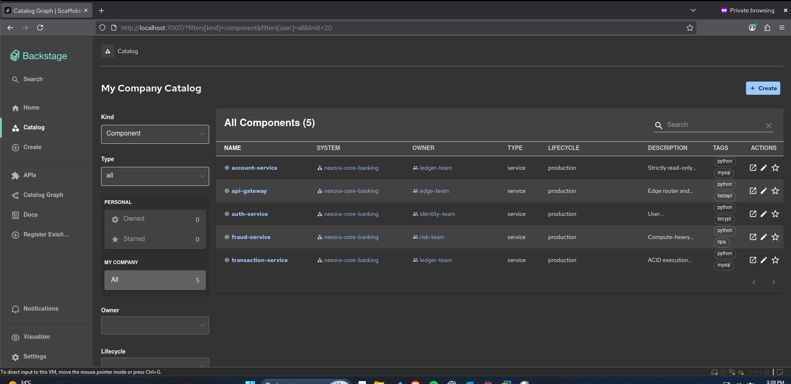
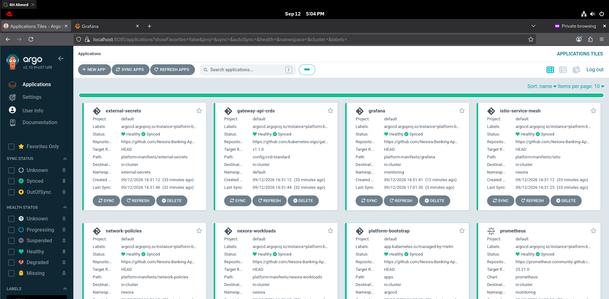

***

<div align="center">

# Nexora Core Banking: Platform Configuration (`platform-config`)

### GitOps Root, Service Mesh, Zero-Trust Policies, and Developer Experience

**ArgoCD • Istio Service Mesh • Kubernetes NetworkPolicies • Prometheus • Grafana • Backstage**

<br>


<br>

This repository is the **GitOps Root** for the Nexora Enterprise Platform. Following the declarative App-of-Apps pattern, a single root application injected during Terraform provisioning reconciles all platform controllers, security boundaries, and developer tools directly from this repository without manual operator intervention.

</div>

---

## Table of Contents

1. [Architectural Philosophy](#architectural-philosophy)
2. [Directory Structure](#directory-structure)
3. [The App-of-Apps Synchronization Model](#the-app-of-apps-synchronization-model)
4. [Platform Component Specifications](#platform-component-specifications)
5. [Operator Tooling & Local Access](#operator-tooling--local-access)
6. [Real-World Troubleshooting & Solutions](#real-world-troubleshooting--solutions)
7. [Known Gaps & Open Items](#known-gaps--open-items)

---

## Architectural Philosophy

In this platform, **the cluster is a runtime projection of Git**. 

Terraform installs the core Kubernetes operators (ArgoCD, Istio Base/Istiod, Argo Rollouts, AWS Load Balancer Controller) and injects the `platform-bootstrap` Root Application. From that moment forward, **`platform-config` assumes complete ownership of cluster state**.

Application workloads (`nexora-apps`) do not configure their own security policies, service meshes, or cluster-scoped namespaces; the platform layer declares these primitives centrally to enforce corporate compliance and zero-trust isolation.

---

## Directory Structure

```text
platform-config/
├── apps/                               <-- ArgoCD Application Manifests (Root App-of-Apps Targets)
│   ├── external-secrets.yaml           <-- ESO Helm chart & SecretStore
│   ├── gateway-api.yaml                <-- Official Kubernetes Gateway API CRDs
│   ├── grafana.yaml                    <-- Grafana Helm deployment & datasources
│   ├── istio.yaml                      <-- Istio mTLS PeerAuthentication policies
│   ├── network-policies.yaml           <-- Zero-Trust microsegmentation & Namespace
│   ├── nexora-workloads.yaml           <-- Workload pointer to app-manifests (Sync Wave 5)
│   └── prometheus.yaml                 <-- In-memory Prometheus monitoring stack
│
├── platform-manifests/                 <-- The Kustomize Blueprints & Configurations
│   ├── external-secrets/               <-- SecretStore & ESO CRD definitions
│   ├── grafana/                        <-- Kustomize overlay & ESO password binding
│   ├── istio/                          <-- PeerAuthentication mTLS rules
│   ├── network-policies/               <-- Unified policies.yaml (Default-deny + microservice rules)
│   └── backstage/                      <-- Spotify Backstage IDP Helm chart & RFC 6902 JSON patch
│
└── scripts/
    └── open-dashboards.sh              <-- 1-Click operator dashboard launcher
```

---

## The App-of-Apps Synchronization Model

Instead of managing individual applications manually, the platform uses an **App-of-Apps hierarchy** governed by ArgoCD Sync Waves:

```text
[ Terraform Root Application: platform-bootstrap ]
                        │
                        ▼ (Watches platform-config/apps/)
     ┌──────────────────┼──────────────────┬──────────────────┐
     ▼ (Wave 0)         ▼ (Wave 0)         ▼ (Wave 0)         ▼ (Wave 5)
[ gateway-api ]    [ istio-mesh ]     [ network-policies ] [ nexora-workloads ]
(Installs CRDs)    (Enforces mTLS)    (Creates Namespace   (Deploys banking
                                       & Default-Deny)      microservices)
```

### Sync Wave Discipline: Eliminating Bootstrapping Races
To prevent workloads from attempting to mount secrets or attach to namespaces before platform controllers are healthy:
* **Wave 0:** Infrastructure components (`gateway-api`, `external-secrets`, `network-policies`, `istio`).
* **Wave 5:** `nexora-workloads` (Guarantees that AWS Secrets Manager credentials, namespaces, and mTLS sidecars are 100% active before banking pods attempt to boot).

---

## Platform Component Specifications

### 1. Zero-Trust Network Policies (`/network-policies`)
Consolidated into a single file (`policies.yaml`) to eliminate Kustomize file-accumulation errors.
* **Namespace Ownership:** Centrally creates `Namespace/nexora` with the `istio-injection: enabled` label baked in.
* **Default-Deny:** Drops all ingress and egress network traffic across the namespace by default (only DNS port 53 is whitelisted).
* **Explicit Microsegmentation:**
  * `api-gateway`: Allowed ingress from Load Balancer; egress to `auth`, `account`, and `transaction` services.
  * `transaction-service`: Ingress from `api-gateway` and `auth-service`; egress to `fraud-service` and MySQL port 3306.
  * `fraud-service`: Ingress strictly from `transaction-service`. Egress strictly blocked.

### 2. Service Mesh mTLS (`/istio`)
* **PeerAuthentication:** Deploys `default-strict-mtls` in `mode: PERMISSIVE`. This allows the external Ingress Gateway to deliver public HTTP traffic while enforcing mutual TLS (mTLS) with automatic X.509 certificate rotation across all internal pod-to-pod financial traffic.

### 3. External Secrets Operator (`/external-secrets`)
* **ClusterSecretStore:** Binds to AWS Secrets Manager in `us-east-1` using the pod's IRSA ServiceAccount.
* **Zero Plaintext Secrets:** Completely eliminates static secrets in Git. Pulls database passwords, JWT encryption keys, and internal service secrets dynamically into Kubernetes memory.

### 4. Observability Stack (`/prometheus` & `/grafana`)
* **Prometheus:** Deployed in-memory (`emptyDir`) without persistent volume claims to prevent AWS EBS CSI storage driver dependencies in Staging. Sized with 2 GB RAM limit to prevent TSDB initialization OOMKills.
* **Grafana:** Pre-configured with automated Prometheus datasource bindings. Secret credentials (`admin-password`) are pulled dynamically from AWS Secrets Manager via ESO, using `disableNameSuffixHash: true` to prevent Kustomize name mismatches.

### 5. Developer Experience: Backstage IDP (`/backstage`)
* Deployed via the official Backstage Helm chart.
* **RFC 6902 JSON Patch:** Injects `APP_CONFIG_backend_auth_dangerouslyDisableDefaultAuthPolicy = true` and `APP_CONFIG_auth_environment = development` directly into the container spec, allowing unauthenticated Guest access for development demos.
* Imports the core banking catalog and visualizes inter-service dependencies.



---

## Operator Tooling & Local Access

In compliance with enterprise banking security, administrative control planes (ArgoCD, Grafana, Backstage) are **never exposed to the public internet**.

Platform engineers access internal tooling via cluster-authenticated port-forwarding (governed by AWS IAM Access Entries on the EKS cluster):

```bash
cd platform-config
./scripts/open-dashboards.sh
```

**Automated Launcher Output:**
* **Banking Application:** `http://<AWS_LOAD_BALANCER_URL>` (Public Ingress)
* **ArgoCD GitOps Dashboard:** `https://localhost:8081` *(User: admin)*
* **Grafana Observability Suite:** `http://localhost:3000` *(User: admin, Password pulled from AWS Secrets Manager)*
* **Backstage Developer Portal:** `http://localhost:7007` *(Guest Login)*



---

## Real-World Troubleshooting & Solutions

### 1. Backstage Node.js Crash on Array Environment Variables
* **Symptom:** The Backstage container entered `CrashLoopBackOff` with `TypeError: Invalid env config key 'catalog_locations_0_type'`.
* **Diagnosis:** Backstage’s `@backstage/config-loader` parses `APP_CONFIG_*` environment variables using underscores as delimiters, but explicitly forbids numeric array indices (like `_0_`).
* **Fix:** Removed array configurations from environment variables. Configured Backstage to use scalar auth bypass keys, and imported the catalog URL directly through the Backstage UI import pipeline.

### 2. Kustomize SecretGenerator Name-Hashing Collision with ESO
* **Symptom:** Grafana pod failed to start with `couldn't find key admin-password in Secret monitoring/grafana-admin-credentials-dthb4m5b7m`.
* **Diagnosis:** Kustomize’s `secretGenerator` appended a random content hash (`-dthb4m5b7m`) to the secret name. The Helm chart looked for the hashed name, but ESO was writing the password into the unhashed plain secret name.
* **Fix:** Added `generatorOptions: disableNameSuffixHash: true` to `platform-manifests/grafana/kustomization.yaml` to guarantee exact name alignment.

### 3. Prometheus Server OOMKilled at 57 Seconds
* **Symptom:** `prometheus-server` repeatedly entered `CrashLoopBackOff` (Exit Code 137) roughly one minute after boot.
* **Diagnosis:** Prometheus started with 256Mi memory. At 30 seconds, it began actively scraping metrics from 8 microservices, AWS CNI, and the EKS control plane. The metric buffer exceeded 256Mi, triggering a kernel OOMKill.
* **Fix:** Increased the memory allocation to 2 GiB in `apps/prometheus.yaml`, providing sufficient headroom for TSDB block indexing.

### 4. Database Init Job Connection Refused (Error 111)
* **Symptom:** `nexora-db-init-job` failed to connect to MySQL on AWS RDS with `ERROR 2003 (HY000): Can't connect to MySQL server (111)`.
* **Diagnosis:** Two compounding issues: (1) `default-deny-all` NetworkPolicy blocked all egress from the job pod. (2) Istio injected an unready Envoy sidecar into the one-off batch job, which reset the TCP connection.
* **Fix:** Added a dedicated egress NetworkPolicy rule for the job pod, and added the `sidecar.istio.io/inject: "false"` annotation to the job template to bypass Istio iptables interception entirely.

---

## Known Gaps & Open Items

* **Prometheus Ephemeral Storage:** Prometheus runs in-memory without persistent volumes. Metrics history is lost upon pod restarts. Production deployments require provisioning the AWS EBS CSI driver and binding to an encrypted `gp3` StorageClass.
* **Istio Ingress mTLS Permissive Mode:** `PeerAuthentication` is configured with `mode: PERMISSIVE` rather than `STRICT` at the namespace root to accommodate plain HTTP traffic forwarded by the Ingress Load Balancer. In a strict zero-trust audit, mTLS should be terminated at the Gateway pod, and a `DestinationRule` should enforce strict mTLS for all subsequent internal hops.
* **Backstage Development Auth Bypass:** `dangerouslyDisableDefaultAuthPolicy: true` is enabled via Kustomize patch to allow unauthenticated guest evaluation for demonstration purposes. In a true production deployment, this bypass is removed, and Backstage must be integrated with an enterprise identity provider (e.g., GitHub OAuth, Okta, or Keycloak).